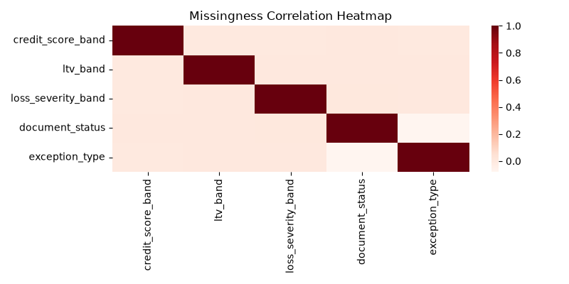
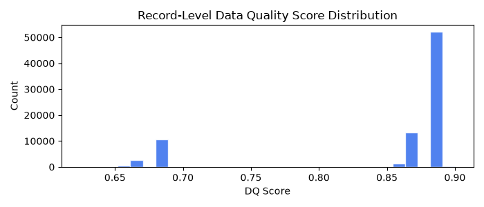

# Data Intelligence & Profiling Report

Generated by `src/profiling/data_intelligence.py` on 2026-08-31 20:00.

**Dataset**: 81,189 panel rows × 33 columns | 5,000 unique loans | months 1–42

## 1. Column Distribution Summaries

### 1.1 Numeric Columns

| Column                   | Count   |      Mean |    Median |       Std |     Min |              Max |   Skew |       p5 |       p95 |
|:-------------------------|:--------|----------:|----------:|----------:|--------:|-----------------:|-------:|---------:|----------:|
| month_index              | 81,189  |     12.72 |     10    |     10.12 |     1   |     42           |   0.97 |     1    |     34    |
| loan_age_months          | 81,189  |     12.72 |     10    |     10.12 |     1   |     42           |   0.97 |     1    |     34    |
| remaining_term_months    | 81,189  |    347.28 |    350    |     10.12 |   318   |    359           |  -0.97 |   326    |    359    |
| original_balance         | 81,189  | 228317    | 201343    | 119422    | 50000   | 984728           |   1.42 | 88535    | 465145    |
| current_balance          | 81,189  | 228486    | 194278    | 248639    |     0   |      1.35191e+07 |  15.6  | 61988.9  | 464694    |
| interest_rate            | 81,189  |      4.71 |      4.68 |      0.63 |     3.5 |      6.5         |   0.41 |     3.77 |      5.83 |
| days_past_due            | 81,189  |     12.42 |      0    |     27.06 |     0   |    120           |   2.36 |     0    |     65    |
| modification_flag        | 81,189  |      0.01 |      0    |      0.09 |     0   |      1           |  11.17 |     0    |      0    |
| prepayment_flag          | 81,189  |      0.04 |      0    |      0.19 |     0   |      1           |   4.78 |     0    |      0    |
| default_flag             | 81,189  |      0.02 |      0    |      0.14 |     0   |      1           |   6.7  |     0    |      0    |
| next_3m_delinquency_flag | 81,189  |      0.39 |      0    |      0.49 |     0   |      1           |   0.47 |     0    |      1    |
| next_6m_delinquency_flag | 81,189  |      0.53 |      1    |      0.5  |     0   |      1           |  -0.11 |     0    |      1    |
| next_12m_default_flag    | 81,189  |      0.19 |      0    |      0.39 |     0   |      1           |   1.57 |     0    |      1    |
| next_12m_prepayment_flag | 81,189  |      0.26 |      0    |      0.44 |     0   |      1           |   1.08 |     0    |      1    |
| exception_required       | 81,189  |      0.01 |      0    |      0.08 |     0   |      1           |  12.81 |     0    |      0    |

### 1.2 Categorical Columns

| Column             |   Cardinality | Top1             | Top1_Pct   |   Rare(<1%) | Missing%   |
|:-------------------|--------------:|:-----------------|:-----------|------------:|:-----------|
| loan_id            |          5000 | LN0004627        | 0.1%       |        5000 | 0.0%       |
| reporting_month    |           101 | 2022-06          | 1.7%       |          46 | 0.0%       |
| origination_month  |            61 | 2022-03          | 2.1%       |           1 | 0.0%       |
| credit_score_band  |             4 | Good             | 38.3%      |           0 | 6.4%       |
| ltv_band           |             4 | 60-75            | 35.4%      |           0 | 6.9%       |
| dti_band           |             4 | 28-36            | 35.0%      |           0 | 0.0%       |
| state              |            10 | WA               | 10.8%      |           0 | 0.0%       |
| loan_purpose       |             3 | Purchase         | 48.9%      |           0 | 0.0%       |
| occupancy_type     |             3 | PrimaryResidence | 75.5%      |           0 | 0.0%       |
| property_type      |             4 | SingleFamily     | 58.4%      |           0 | 0.0%       |
| servicer_name      |             4 | ServicerD        | 25.2%      |           0 | 0.0%       |
| current_status     |             7 | Current          | 73.7%      |           1 | 0.0%       |
| loss_severity_band |             3 | Low              | 90.0%      |           0 | 6.2%       |
| last_updated_at    |           101 | 2022-06-01       | 1.7%       |          46 | 0.0%       |
| source_system      |             1 | PRIMARY          | 100.0%     |           0 | 0.0%       |
| document_status    |             4 | Complete         | 60.2%      |           0 | 4.7%       |
| next_state         |             7 | Current          | 67.9%      |           0 | 0.0%       |
| exception_type     |             1 | DocumentGap      | 100.0%     |           0 | 99.4%      |

## 2. Missing-Value Pattern Analysis

| Column             |   Missing_% |
|:-------------------|------------:|
| exception_type     |       99.4  |
| ltv_band           |        6.91 |
| credit_score_band  |        6.38 |
| loss_severity_band |        6.18 |
| document_status    |        4.71 |

**MNAR signal**: `document_status` missing → default rate = **0.127** vs present → **0.016** (⚠ MNAR suspected)

## 3. Outlier Detection

| Column          |   IQR_outliers |   ZScore>4_outliers |     IQR_lo |   IQR_hi |
|:----------------|---------------:|--------------------:|-----------:|---------:|
| current_balance |            717 |                 340 | -291335    | 700692   |
| interest_rate   |              0 |                   0 |       1.57 |      7.8 |
| days_past_due   |          17611 |                   0 |       0    |      0   |
| loan_age_months |              0 |                   0 |     -34    |     57   |

**Date violations**: `origination_month > reporting_month` in **242** records

## 4. Feature Correlation Analysis

No highly correlated feature pairs detected (|r| > 0.8 threshold).

## 5. Validation Rule Violations

| rule_id   | rule_name             | severity   |   count |   pct_of_panel |
|:----------|:----------------------|:-----------|--------:|---------------:|
| VR001     | balance_consistency   | error      |     398 |          0.49  |
| VR002     | date_validity         | error      |     242 |          0.298 |
| VR005     | document_completeness | warning    |     158 |          0.195 |
| VR006     | balance_monotonic     | warning    |     370 |          0.456 |

## 6. Train vs. Test Distribution Drift

| Column                   |     PSI |   KS_stat | Status       |
|:-------------------------|--------:|----------:|:-------------|
| month_index              | 20.7318 |    1      | ⚠ HIGH DRIFT |
| loan_age_months          | 20.7318 |    1      | ⚠ HIGH DRIFT |
| remaining_term_months    | 20.7327 |    1      | ⚠ HIGH DRIFT |
| original_balance         |  0.0042 |    0.0237 | OK           |
| current_balance          |  0.0099 |    0.044  | OK           |
| interest_rate            |  0.069  |    0.1047 | OK           |
| days_past_due            |  0.0031 |    0.0224 | OK           |
| modification_flag        |  0      |    0.0009 | OK           |
| prepayment_flag          |  0      |    0.0057 | OK           |
| default_flag             |  0      |    0.0039 | OK           |
| next_3m_delinquency_flag |  0      |    0.075  | OK           |
| next_6m_delinquency_flag |  0      |    0.1037 | OK           |
| next_12m_default_flag    |  0      |    0.0995 | OK           |
| next_12m_prepayment_flag |  0      |    0.0616 | OK           |
| exception_required       |  0      |    0.0013 | OK           |

## 7. Data-Quality Scores

**Batch-level DQ score**: **0.846** / 1.000

Distribution: mean=0.846, p10=0.685, p50=0.885, p90=0.885

## 8. Servicer Update Conflict Analysis

Servicer feed contains **5,412** update records.

Conflict rate (status mismatch vs primary): **100.0%**

Top 10 loans by conflict frequency:

| loan_id   |   n_conflicts |
|:----------|--------------:|
| LN0004975 |             2 |
| LN0004973 |             2 |
| LN0000020 |             2 |
| LN0000019 |             2 |
| LN0004951 |             2 |
| LN0004943 |             2 |
| LN0004937 |             2 |
| LN0004933 |             2 |
| LN0004903 |             2 |
| LN0004897 |             2 |

## 9. Categorical Association Patterns

*Association-rule mining skipped: Expected numeric dtype, got object instead.*

## 10. Top Data Quality Issues Summary

| loan_id   |   month_index | issue                       | severity   | details                            |
|:----------|--------------:|:----------------------------|:-----------|:-----------------------------------|
| LN0001580 |            13 | [VR001] balance_consistency | error      | current_balance > 105% of original |
| LN0000655 |             3 | [VR001] balance_consistency | error      | current_balance > 105% of original |
| LN0004883 |            12 | [VR001] balance_consistency | error      | current_balance > 105% of original |
| LN0001887 |            10 | [VR001] balance_consistency | error      | current_balance > 105% of original |
| LN0001140 |             5 | [VR001] balance_consistency | error      | current_balance > 105% of original |
| LN0002836 |            16 | [VR001] balance_consistency | error      | current_balance > 105% of original |
| LN0001811 |            24 | [VR001] balance_consistency | error      | current_balance > 105% of original |
| LN0004293 |            17 | [VR001] balance_consistency | error      | current_balance > 105% of original |
| LN0000204 |             1 | [VR001] balance_consistency | error      | current_balance > 105% of original |
| LN0002251 |            17 | [VR001] balance_consistency | error      | current_balance > 105% of original |
| LN0000519 |            11 | [VR001] balance_consistency | error      | current_balance > 105% of original |
| LN0001751 |             9 | [VR001] balance_consistency | error      | current_balance > 105% of original |
| LN0001747 |            16 | [VR001] balance_consistency | error      | current_balance > 105% of original |
| LN0001833 |            13 | [VR001] balance_consistency | error      | current_balance > 105% of original |
| LN0000226 |             7 | [VR001] balance_consistency | error      | current_balance > 105% of original |
| LN0002088 |             5 | [VR001] balance_consistency | error      | current_balance > 105% of original |
| LN0001930 |             8 | [VR001] balance_consistency | error      | current_balance > 105% of original |
| LN0003965 |            18 | [VR001] balance_consistency | error      | current_balance > 105% of original |
| LN0004855 |             2 | [VR001] balance_consistency | error      | current_balance > 105% of original |
| LN0001319 |            17 | [VR001] balance_consistency | error      | current_balance > 105% of original |
