# Explainability Report

Generated on 2026-08-31 20:01

## next_3m_delinquency_flag

### Global Feature Importance (mean |SHAP|)

| Feature                 |   Mean_|SHAP| |
|:------------------------|--------------:|
| status_roll3_max        |       0.63859 |
| days_past_due           |       0.35171 |
| credit_score_band_enc   |       0.24955 |
| dti_band_enc            |       0.24222 |
| ltv_band_enc            |       0.2262  |
| current_status_enc      |       0.10216 |
| interest_rate           |       0.06023 |
| month_index             |       0.04817 |
| balance_utilisation     |       0.04133 |
| days_past_due_roll6_max |       0.03733 |

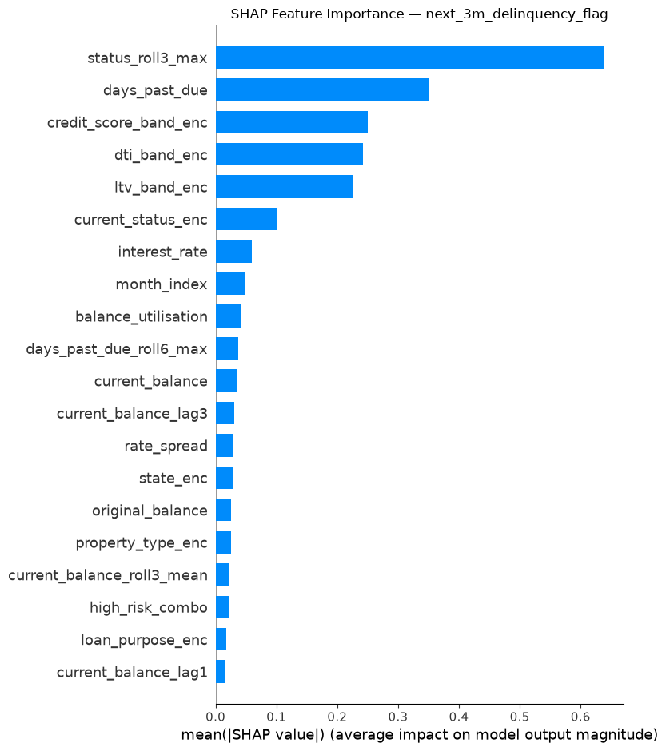

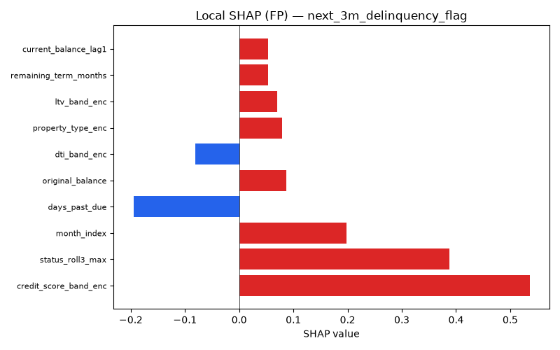

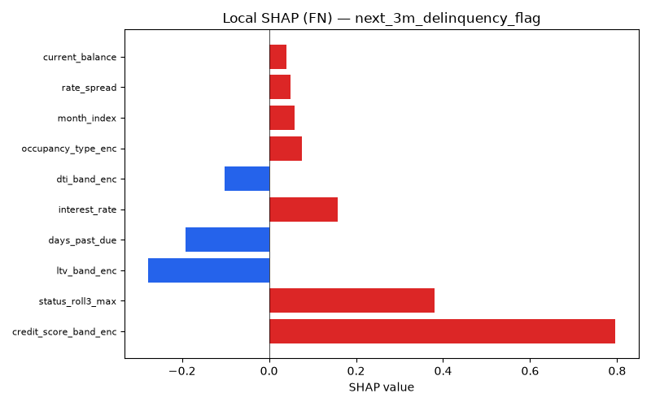

### FP/FN Analysis — next_3m_delinquency_flag

- **False Positives**: 404 (9.1% of predictions)
- **False Negatives**: 965 (21.8% of predictions)

**False Positives characteristics:**
  - `credit_score_band` mode: Good
  - `ltv_band` mode: 75-90
  - `days_past_due` mean: 18.66
  - `loan_age_months` mean: 28.01

**False Negatives characteristics:**
  - `credit_score_band` mode: Good
  - `ltv_band` mode: 60-75
  - `days_past_due` mean: 5.88
  - `loan_age_months` mean: 27.91

### Prediction Uncertainty

Mean prediction entropy: **0.5725** (higher = more uncertain)

Fraction of records with entropy > 0.5: **0.807**

## next_6m_delinquency_flag

### Global Feature Importance (mean |SHAP|)

| Feature                 |   Mean_|SHAP| |
|:------------------------|--------------:|
| status_roll3_max        |       0.78264 |
| ltv_band_enc            |       0.32497 |
| dti_band_enc            |       0.32322 |
| credit_score_band_enc   |       0.31925 |
| days_past_due           |       0.26819 |
| balance_utilisation     |       0.2387  |
| current_status_enc      |       0.17115 |
| interest_rate           |       0.11494 |
| days_past_due_roll6_max |       0.10444 |
| original_balance        |       0.09882 |

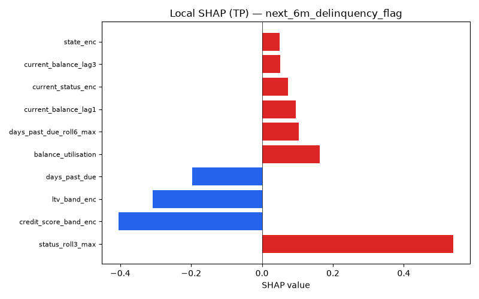

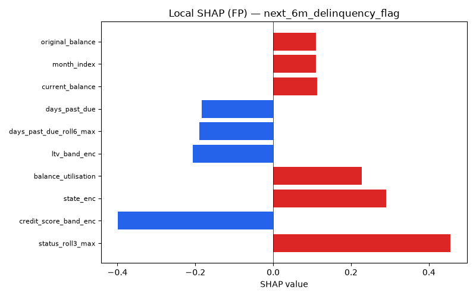

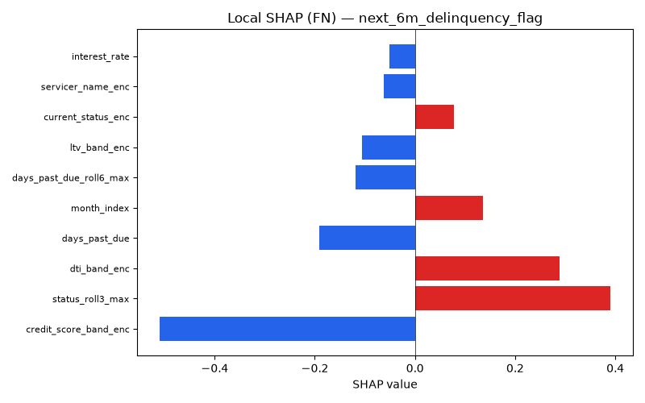

### FP/FN Analysis — next_6m_delinquency_flag

- **False Positives**: 1,144 (25.9% of predictions)
- **False Negatives**: 464 (10.5% of predictions)

**False Positives characteristics:**
  - `credit_score_band` mode: Good
  - `ltv_band` mode: 60-75
  - `days_past_due` mean: 7.64
  - `loan_age_months` mean: 27.90

**False Negatives characteristics:**
  - `credit_score_band` mode: Good
  - `ltv_band` mode: 60-75
  - `days_past_due` mean: 2.72
  - `loan_age_months` mean: 27.80

### Prediction Uncertainty

Mean prediction entropy: **0.5949** (higher = more uncertain)

Fraction of records with entropy > 0.5: **0.867**

## next_12m_default_flag

### Global Feature Importance (mean |SHAP|)

| Feature               |   Mean_|SHAP| |
|:----------------------|--------------:|
| status_roll3_max      |       0.64016 |
| ltv_band_enc          |       0.51078 |
| credit_score_band_enc |       0.50022 |
| dti_band_enc          |       0.45026 |
| days_past_due         |       0.29066 |
| interest_rate         |       0.23272 |
| balance_utilisation   |       0.14791 |
| state_enc             |       0.13156 |
| original_balance      |       0.12624 |
| current_status_enc    |       0.09838 |

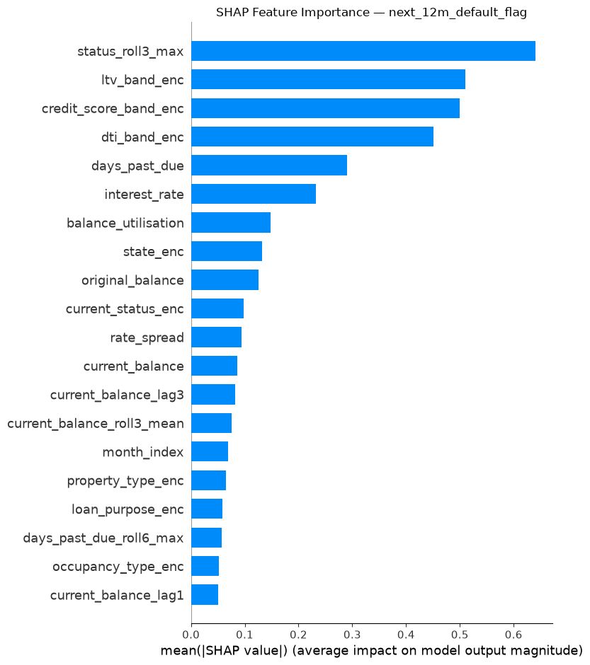

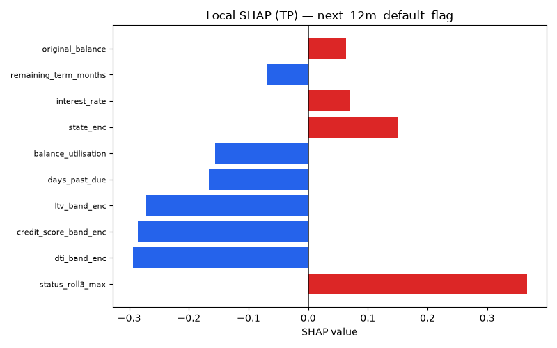

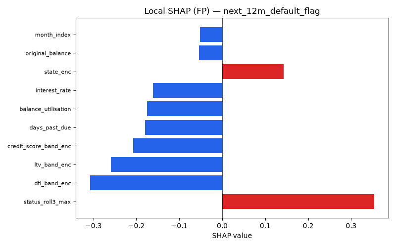

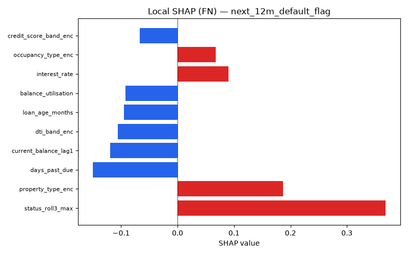

### FP/FN Analysis — next_12m_default_flag

- **False Positives**: 113 (2.6% of predictions)
- **False Negatives**: 578 (13.1% of predictions)

**False Positives characteristics:**
  - `credit_score_band` mode: Fair
  - `ltv_band` mode: 75-90
  - `days_past_due` mean: 106.68
  - `loan_age_months` mean: 27.75

**False Negatives characteristics:**
  - `credit_score_band` mode: Good
  - `ltv_band` mode: 75-90
  - `days_past_due` mean: 16.83
  - `loan_age_months` mean: 27.91

### Prediction Uncertainty

Mean prediction entropy: **0.4634** (higher = more uncertain)

Fraction of records with entropy > 0.5: **0.408**

## next_12m_prepayment_flag

### Global Feature Importance (mean |SHAP|)

| Feature               |   Mean_|SHAP| |
|:----------------------|--------------:|
| current_status_enc    |       0.30029 |
| status_roll3_max      |       0.26172 |
| interest_rate         |       0.19451 |
| credit_score_band_enc |       0.18653 |
| month_index           |       0.16106 |
| days_past_due         |       0.15168 |
| original_balance      |       0.13342 |
| current_balance       |       0.12673 |
| dti_band_enc          |       0.11447 |
| loan_purpose_enc      |       0.09672 |

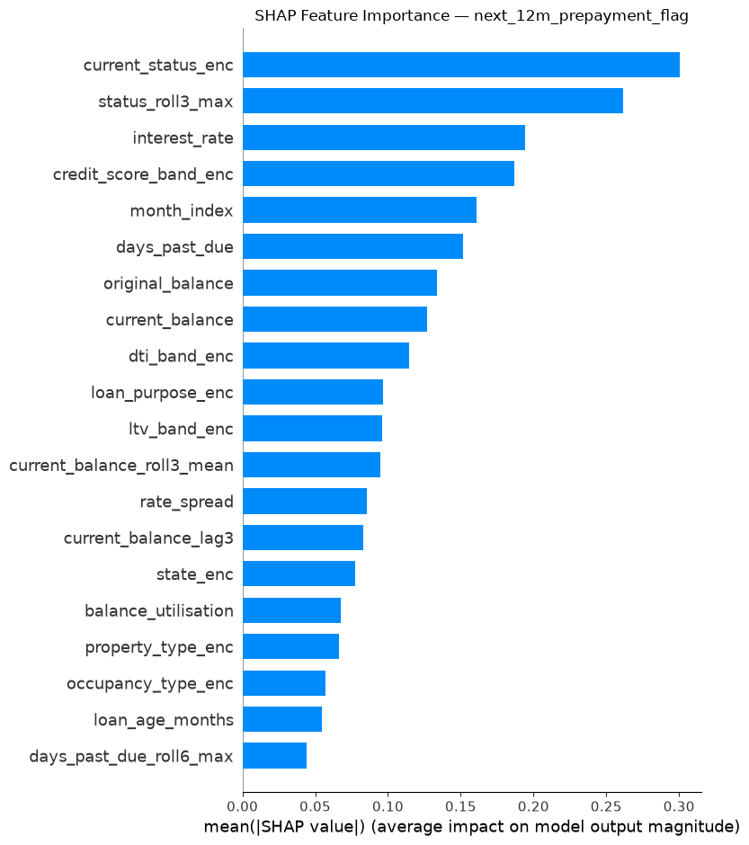

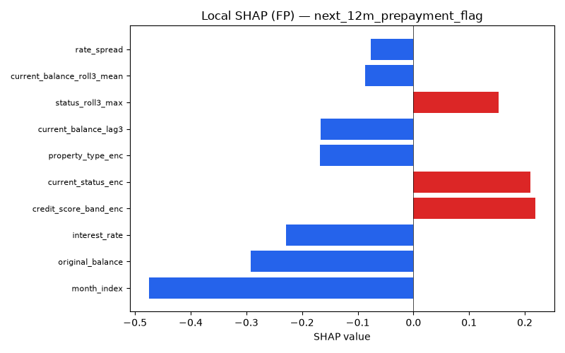

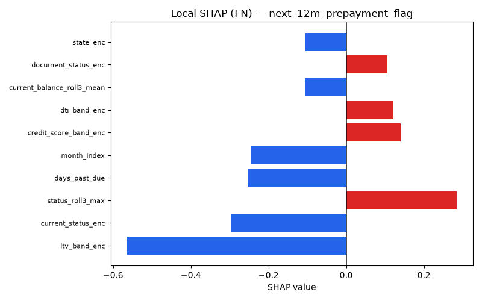

### FP/FN Analysis — next_12m_prepayment_flag

- **False Positives**: 2,211 (50.0% of predictions)
- **False Negatives**: 279 (6.3% of predictions)

**False Positives characteristics:**
  - `credit_score_band` mode: Good
  - `ltv_band` mode: 60-75
  - `days_past_due` mean: 0.00
  - `loan_age_months` mean: 27.89

**False Negatives characteristics:**
  - `credit_score_band` mode: Good
  - `ltv_band` mode: 60-75
  - `days_past_due` mean: 27.22
  - `loan_age_months` mean: 27.96

### Prediction Uncertainty

Mean prediction entropy: **0.6653** (higher = more uncertain)

Fraction of records with entropy > 0.5: **0.957**

