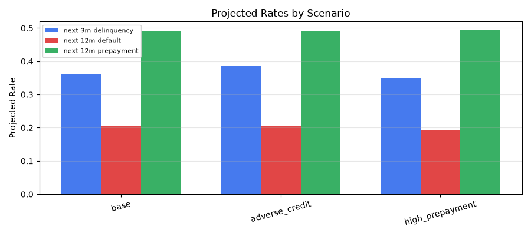

# Scenario & Stress Simulation Report

Generated on 2026-08-31 20:01

## Aggregate Projected Rates

| scenario        |   next_3m_delinquency_flag |   next_12m_default_flag |   next_12m_prepayment_flag |
|:----------------|---------------------------:|------------------------:|---------------------------:|
| base            |                   0.362899 |                0.204714 |                   0.492414 |
| adverse_credit  |                   0.385868 |                0.204509 |                   0.492722 |
| high_prepayment |                   0.350169 |                0.194049 |                   0.495064 |

## Segment-Level Default Rate by Scenario

| segment_col       | segment_val   | scenario        |   default_rate |   n_loans |
|:------------------|:--------------|:----------------|---------------:|----------:|
| credit_score_band | Poor          | base            |         0.2921 |       210 |
| credit_score_band | Poor          | adverse_credit  |         0.2857 |       210 |
| credit_score_band | Poor          | high_prepayment |         0.2784 |       210 |
| credit_score_band | Fair          | base            |         0.2683 |       791 |
| credit_score_band | Fair          | adverse_credit  |         0.2619 |       791 |
| credit_score_band | Fair          | high_prepayment |         0.2557 |       791 |
| state             | WA            | base            |         0.2215 |       499 |
| state             | WA            | adverse_credit  |         0.2207 |       499 |
| state             | CA            | base            |         0.2146 |       414 |
| state             | CA            | adverse_credit  |         0.2137 |       414 |
| state             | IL            | base            |         0.2125 |       479 |
| state             | IL            | adverse_credit  |         0.2122 |       479 |
| state             | GA            | base            |         0.2111 |       417 |
| servicer_name     | ServicerC     | base            |         0.2111 |      1069 |
| servicer_name     | ServicerC     | adverse_credit  |         0.2107 |      1069 |
| state             | NV            | adverse_credit  |         0.2105 |       397 |
| state             | GA            | adverse_credit  |         0.2104 |       417 |
| state             | WA            | high_prepayment |         0.2103 |       499 |
| state             | NV            | base            |         0.2101 |       397 |
| servicer_name     | ServicerD     | base            |         0.2054 |      1148 |
| servicer_name     | ServicerD     | adverse_credit  |         0.2053 |      1148 |
| servicer_name     | ServicerB     | base            |         0.2047 |      1115 |
| servicer_name     | ServicerB     | adverse_credit  |         0.2044 |      1115 |
| state             | TX            | base            |         0.2043 |       456 |
| state             | TX            | adverse_credit  |         0.2039 |       456 |
| state             | CA            | high_prepayment |         0.2037 |       414 |
| state             | IL            | high_prepayment |         0.2016 |       479 |
| credit_score_band | Good          | base            |         0.2009 |      1784 |
| servicer_name     | ServicerC     | high_prepayment |         0.2003 |      1069 |
| state             | GA            | high_prepayment |         0.2    |       417 |

## Scenario Sensitivity Drivers

The most sensitive inputs under each scenario:

- **adverse_credit**: `credit_score_band_enc` (+1 notch down) drives a 0.000 absolute increase in 12m default rate.

- **high_prepayment**: `interest_rate` shift (−0.75pp) and increased prepay propensity drive prepayment rate up by 0.003.
