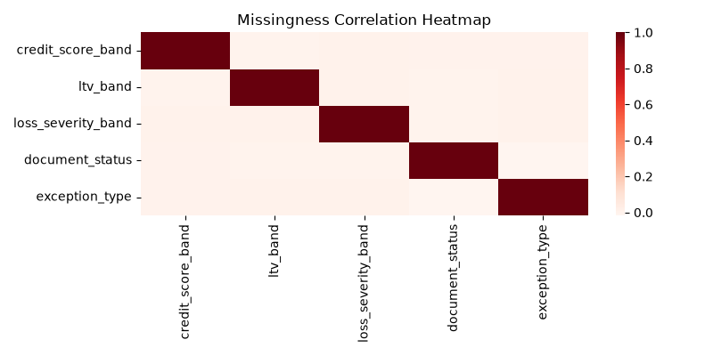
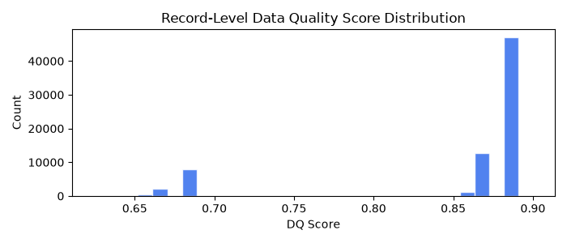

# Data Intelligence & Profiling Report

Generated by `src/profiling/data_intelligence.py` on 2026-08-28 01:56.

**Dataset**: 71,634 panel rows × 33 columns | 5,000 unique loans | months 1–30

## 1. Column Distribution Summaries

### 1.1 Numeric Columns

| Column                   | Count   |      Mean |    Median |       Std |     Min |              Max |   Skew |       p5 |       p95 |
|:-------------------------|:--------|----------:|----------:|----------:|--------:|-----------------:|-------:|---------:|----------:|
| month_index              | 71,634  |     10.63 |      9    |      7.81 |     1   |     30           |   0.73 |     1    |     26    |
| loan_age_months          | 71,634  |     10.63 |      9    |      7.81 |     1   |     30           |   0.73 |     1    |     26    |
| remaining_term_months    | 71,634  |    349.37 |    351    |      7.81 |   330   |    359           |  -0.73 |   334    |    359    |
| original_balance         | 71,634  | 228874    | 201745    | 119707    | 50000   | 984728           |   1.37 | 88538    | 466746    |
| current_balance          | 71,634  | 234004    | 197854    | 235416    |     0   |      1.03566e+07 |  15.33 | 79616.9  | 469888    |
| interest_rate            | 71,634  |      4.72 |      4.69 |      0.63 |     3.5 |      6.5         |   0.42 |     3.81 |      5.84 |
| days_past_due            | 71,634  |     10.42 |      0    |     22.77 |     0   |    120           |   2.25 |     0    |     65    |
| modification_flag        | 71,634  |      0.01 |      0    |      0.09 |     0   |      1           |  10.57 |     0    |      0    |
| prepayment_flag          | 71,634  |      0.01 |      0    |      0.12 |     0   |      1           |   8.01 |     0    |      0    |
| default_flag             | 71,634  |      0    |      0    |      0.05 |     0   |      1           |  21.71 |     0    |      0    |
| next_3m_delinquency_flag | 71,634  |      0.38 |      0    |      0.49 |     0   |      1           |   0.5  |     0    |      1    |
| next_6m_delinquency_flag | 71,634  |      0.52 |      1    |      0.5  |     0   |      1           |  -0.09 |     0    |      1    |
| next_12m_default_flag    | 71,634  |      0    |      0    |      0.07 |     0   |      1           |  14.26 |     0    |      0    |
| next_12m_prepayment_flag | 71,634  |      0.02 |      0    |      0.14 |     0   |      1           |   6.65 |     0    |      0    |
| exception_required       | 71,634  |      0    |      0    |      0.03 |     0   |      1           |  39.42 |     0    |      0    |

### 1.2 Categorical Columns

| Column             |   Cardinality | Top1             | Top1_Pct   |   Rare(<1%) | Missing%   |
|:-------------------|--------------:|:-----------------|:-----------|------------:|:-----------|
| loan_id            |          5000 | LN0003428        | 0.0%       |        5000 | 0.0%       |
| reporting_month    |            89 | 2022-06          | 1.8%       |          33 | 0.0%       |
| origination_month  |            61 | 2018-10          | 2.2%       |           1 | 0.0%       |
| credit_score_band  |             4 | Good             | 37.4%      |           0 | 4.3%       |
| ltv_band           |             4 | 60-75            | 36.1%      |           0 | 5.4%       |
| dti_band           |             4 | 28-36            | 36.0%      |           0 | 0.0%       |
| state              |            10 | CA               | 10.7%      |           0 | 0.0%       |
| loan_purpose       |             3 | Purchase         | 49.7%      |           0 | 0.0%       |
| occupancy_type     |             3 | PrimaryResidence | 75.2%      |           0 | 0.0%       |
| property_type      |             4 | SingleFamily     | 59.3%      |           0 | 0.0%       |
| servicer_name      |             4 | ServicerD        | 25.4%      |           0 | 0.0%       |
| current_status     |             7 | Current          | 77.9%      |           2 | 0.0%       |
| loss_severity_band |             3 | Low              | 91.6%      |           1 | 7.8%       |
| last_updated_at    |            89 | 2022-06-01       | 1.8%       |          33 | 0.0%       |
| source_system      |             1 | PRIMARY          | 100.0%     |           0 | 0.0%       |
| document_status    |             4 | Complete         | 60.3%      |           0 | 7.4%       |
| next_state         |             7 | Current          | 71.6%      |           1 | 0.0%       |
| exception_type     |             1 | DocumentGap      | 100.0%     |           0 | 99.9%      |

## 2. Missing-Value Pattern Analysis

| Column             |   Missing_% |
|:-------------------|------------:|
| exception_type     |       99.94 |
| loss_severity_band |        7.84 |
| document_status    |        7.41 |
| ltv_band           |        5.4  |
| credit_score_band  |        4.33 |

**MNAR signal**: `document_status` missing → default rate = **0.006** vs present → **0.002** (⚠ MNAR suspected)

## 3. Outlier Detection

| Column          |   IQR_outliers |   ZScore>4_outliers |     IQR_lo |   IQR_hi |
|:----------------|---------------:|--------------------:|-----------:|---------:|
| current_balance |            587 |                 289 | -290027    | 710218   |
| interest_rate   |              0 |                   0 |       1.57 |      7.8 |
| days_past_due   |          14617 |                 151 |       0    |      0   |
| loan_age_months |              0 |                   0 |     -32    |     52   |

**Date violations**: `origination_month > reporting_month` in **223** records

## 4. Feature Correlation Analysis

No highly correlated feature pairs detected (|r| > 0.8 threshold).

## 5. Validation Rule Violations

| rule_id   | rule_name             | severity   |   count |   pct_of_panel |
|:----------|:----------------------|:-----------|--------:|---------------:|
| VR001     | balance_consistency   | error      |     348 |          0.486 |
| VR002     | date_validity         | error      |     223 |          0.311 |
| VR005     | document_completeness | warning    |      19 |          0.027 |
| VR006     | balance_monotonic     | warning    |     321 |          0.448 |

## 6. Train vs. Test Distribution Drift

| Column                   |     PSI |   KS_stat | Status       |
|:-------------------------|--------:|----------:|:-------------|
| month_index              | 19.8594 |    1      | ⚠ HIGH DRIFT |
| loan_age_months          | 19.8594 |    1      | ⚠ HIGH DRIFT |
| remaining_term_months    | 19.862  |    1      | ⚠ HIGH DRIFT |
| original_balance         |  0.0062 |    0.0178 | OK           |
| current_balance          |  0.007  |    0.0198 | OK           |
| interest_rate            |  0.0684 |    0.0956 | OK           |
| days_past_due            |  0.0018 |    0.0167 | OK           |
| modification_flag        |  0      |    0.0004 | OK           |
| prepayment_flag          |  0      |    0.0159 | OK           |
| default_flag             |  0      |    0.0022 | OK           |
| next_3m_delinquency_flag |  0      |    0.1486 | OK           |
| next_6m_delinquency_flag |  0      |    0.2852 | ⚠ HIGH DRIFT |
| next_12m_default_flag    |  0      |    0.0052 | OK           |
| next_12m_prepayment_flag |  0      |    0.0226 | OK           |
| exception_required       |  0      |    0.0007 | OK           |

## 7. Data-Quality Scores

**Batch-level DQ score**: **0.851** / 1.000

Distribution: mean=0.851, p10=0.685, p50=0.885, p90=0.885

## 8. Servicer Update Conflict Analysis

Servicer feed contains **5,000** update records.

Conflict rate (status mismatch vs primary): **100.0%**

Top 10 loans by conflict frequency:

| loan_id   |   n_conflicts |
|:----------|--------------:|
| LN0005000 |             1 |
| LN0000001 |             1 |
| LN0000002 |             1 |
| LN0000003 |             1 |
| LN0000004 |             1 |
| LN0000005 |             1 |
| LN0000006 |             1 |
| LN0000007 |             1 |
| LN0004961 |             1 |
| LN0004962 |             1 |

## 9. Categorical Association Patterns

*Association-rule mining skipped: Expected numeric dtype, got object instead.*

## 10. Top Data Quality Issues Summary

| loan_id   |   month_index | issue                       | severity   | details                            |
|:----------|--------------:|:----------------------------|:-----------|:-----------------------------------|
| LN0003513 |             8 | [VR001] balance_consistency | error      | current_balance > 105% of original |
| LN0003314 |             3 | [VR001] balance_consistency | error      | current_balance > 105% of original |
| LN0002803 |             4 | [VR001] balance_consistency | error      | current_balance > 105% of original |
| LN0001031 |             7 | [VR001] balance_consistency | error      | current_balance > 105% of original |
| LN0001380 |             9 | [VR001] balance_consistency | error      | current_balance > 105% of original |
| LN0004714 |            20 | [VR001] balance_consistency | error      | current_balance > 105% of original |
| LN0000688 |            14 | [VR001] balance_consistency | error      | current_balance > 105% of original |
| LN0004171 |             6 | [VR001] balance_consistency | error      | current_balance > 105% of original |
| LN0004998 |             7 | [VR001] balance_consistency | error      | current_balance > 105% of original |
| LN0000309 |            13 | [VR001] balance_consistency | error      | current_balance > 105% of original |
| LN0003703 |             6 | [VR001] balance_consistency | error      | current_balance > 105% of original |
| LN0004975 |            19 | [VR001] balance_consistency | error      | current_balance > 105% of original |
| LN0001891 |             5 | [VR001] balance_consistency | error      | current_balance > 105% of original |
| LN0001394 |            15 | [VR001] balance_consistency | error      | current_balance > 105% of original |
| LN0001838 |            24 | [VR001] balance_consistency | error      | current_balance > 105% of original |
| LN0000918 |            15 | [VR001] balance_consistency | error      | current_balance > 105% of original |
| LN0001048 |             7 | [VR001] balance_consistency | error      | current_balance > 105% of original |
| LN0002621 |             9 | [VR001] balance_consistency | error      | current_balance > 105% of original |
| LN0001107 |            18 | [VR001] balance_consistency | error      | current_balance > 105% of original |
| LN0003725 |             2 | [VR001] balance_consistency | error      | current_balance > 105% of original |
