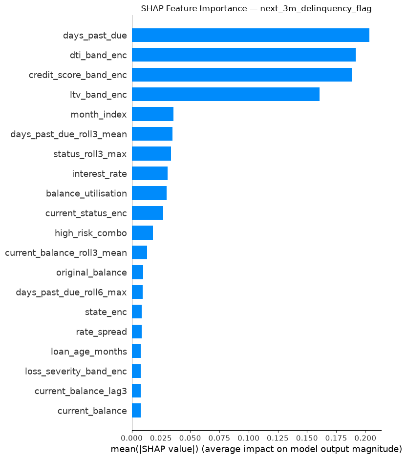
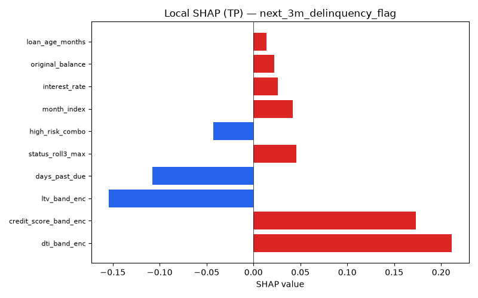
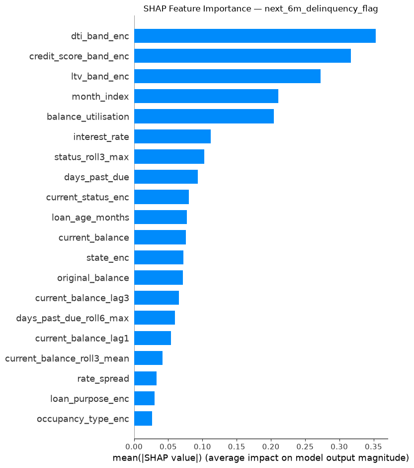
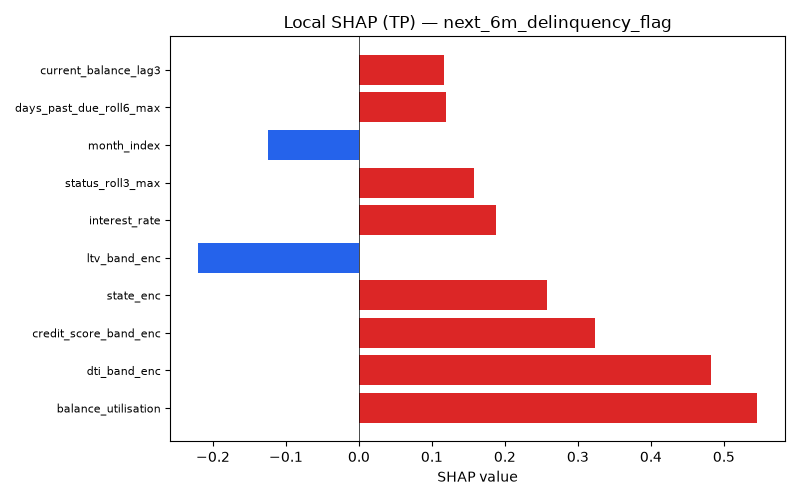
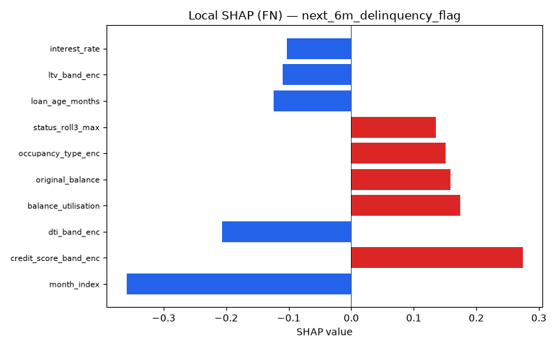
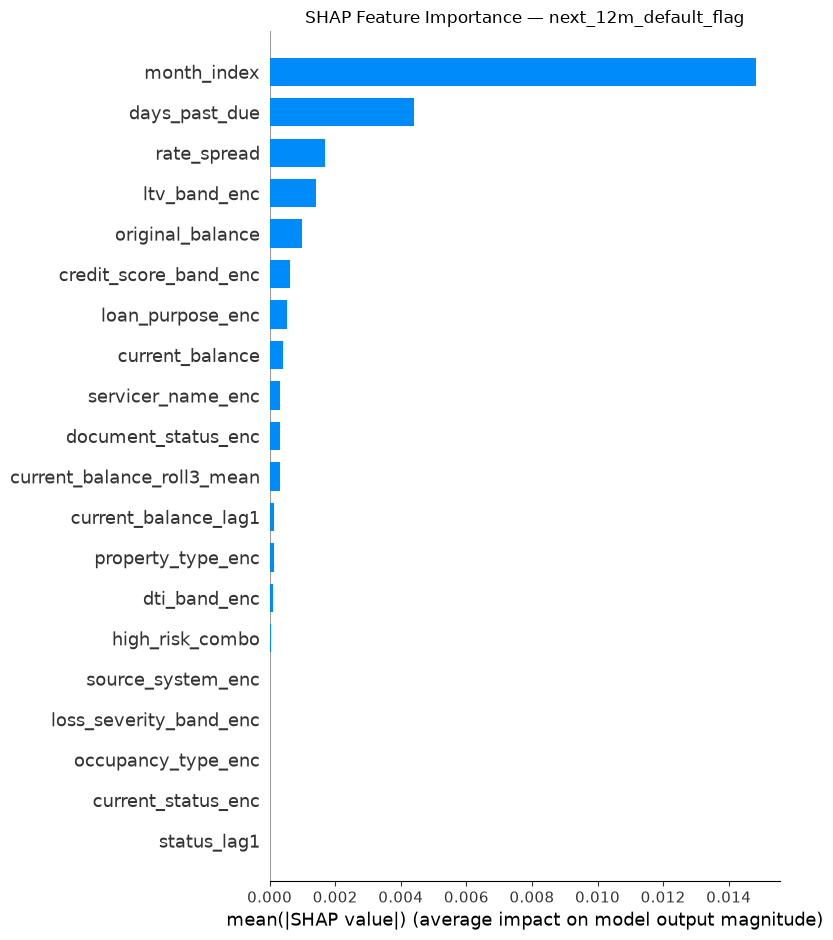
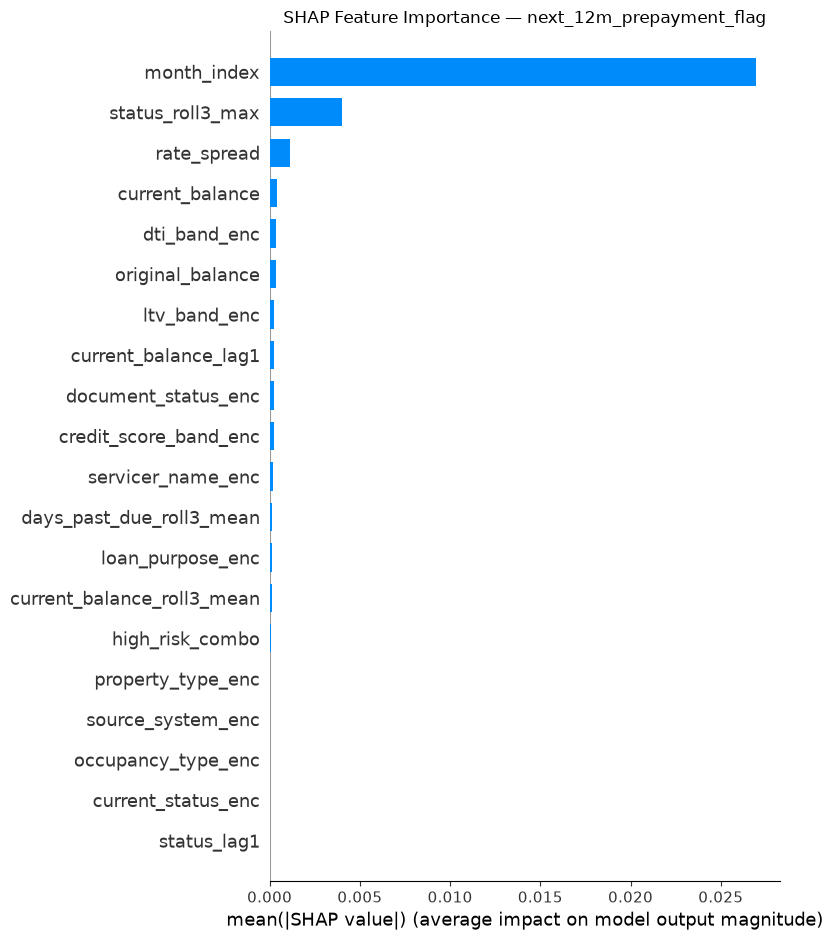

# Explainability Report

Generated on 2026-08-29 03:01

## next_3m_delinquency_flag

### Global Feature Importance (mean |SHAP|)

| Feature                  |   Mean_|SHAP| |
|:-------------------------|--------------:|
| days_past_due            |       0.20326 |
| dti_band_enc             |       0.19164 |
| credit_score_band_enc    |       0.18834 |
| ltv_band_enc             |       0.16071 |
| month_index              |       0.03576 |
| days_past_due_roll3_mean |       0.03476 |
| status_roll3_max         |       0.03351 |
| interest_rate            |       0.03064 |
| balance_utilisation      |       0.03005 |
| current_status_enc       |       0.02688 |

### FP/FN Analysis — next_3m_delinquency_flag

- **False Positives**: 647 (15.0% of predictions)
- **False Negatives**: 717 (16.6% of predictions)

**False Positives characteristics:**
  - `credit_score_band` mode: Good
  - `ltv_band` mode: 75-90
  - `days_past_due` mean: 12.61
  - `loan_age_months` mean: 28.24

**False Negatives characteristics:**
  - `credit_score_band` mode: Good
  - `ltv_band` mode: 60-75
  - `days_past_due` mean: 13.25
  - `loan_age_months` mean: 27.19

### Prediction Uncertainty

Mean prediction entropy: **0.6276** (higher = more uncertain)

Fraction of records with entropy > 0.5: **0.927**

## next_6m_delinquency_flag

### Global Feature Importance (mean |SHAP|)

| Feature               |   Mean_|SHAP| |
|:----------------------|--------------:|
| dti_band_enc          |       0.35301 |
| credit_score_band_enc |       0.3167  |
| ltv_band_enc          |       0.27271 |
| month_index           |       0.21078 |
| balance_utilisation   |       0.20424 |
| interest_rate         |       0.11181 |
| status_roll3_max      |       0.10241 |
| days_past_due         |       0.09341 |
| current_status_enc    |       0.07997 |
| loan_age_months       |       0.07692 |

### FP/FN Analysis — next_6m_delinquency_flag

- **False Positives**: 1,840 (42.6% of predictions)
- **False Negatives**: 331 (7.7% of predictions)

**False Positives characteristics:**
  - `credit_score_band` mode: Good
  - `ltv_band` mode: 60-75
  - `days_past_due` mean: 7.26
  - `loan_age_months` mean: 28.20

**False Negatives characteristics:**
  - `credit_score_band` mode: Good
  - `ltv_band` mode: 60-75
  - `days_past_due` mean: 15.09
  - `loan_age_months` mean: 27.13

### Prediction Uncertainty

Mean prediction entropy: **0.6527** (higher = more uncertain)

Fraction of records with entropy > 0.5: **0.983**

## next_12m_default_flag

### Global Feature Importance (mean |SHAP|)

| Feature               |   Mean_|SHAP| |
|:----------------------|--------------:|
| month_index           |       0.01482 |
| days_past_due         |       0.00441 |
| rate_spread           |       0.00169 |
| ltv_band_enc          |       0.00141 |
| original_balance      |       0.00099 |
| credit_score_band_enc |       0.00061 |
| loan_purpose_enc      |       0.00053 |
| current_balance       |       0.0004  |
| servicer_name_enc     |       0.00032 |
| document_status_enc   |       0.00031 |

### FP/FN Analysis — next_12m_default_flag

- **False Positives**: 0 (0.0% of predictions)
- **False Negatives**: 0 (0.0% of predictions)

### Prediction Uncertainty

Mean prediction entropy: **-0.0000** (higher = more uncertain)

Fraction of records with entropy > 0.5: **0.000**

## next_12m_prepayment_flag

### Global Feature Importance (mean |SHAP|)

| Feature               |   Mean_|SHAP| |
|:----------------------|--------------:|
| month_index           |       0.02693 |
| status_roll3_max      |       0.004   |
| rate_spread           |       0.00112 |
| current_balance       |       0.00041 |
| dti_band_enc          |       0.00036 |
| original_balance      |       0.00034 |
| ltv_band_enc          |       0.00025 |
| current_balance_lag1  |       0.00023 |
| document_status_enc   |       0.00023 |
| credit_score_band_enc |       0.00022 |

### FP/FN Analysis — next_12m_prepayment_flag

- **False Positives**: 0 (0.0% of predictions)
- **False Negatives**: 0 (0.0% of predictions)

### Prediction Uncertainty

Mean prediction entropy: **-0.0000** (higher = more uncertain)

Fraction of records with entropy > 0.5: **0.000**

## next_state (Multiclass)
