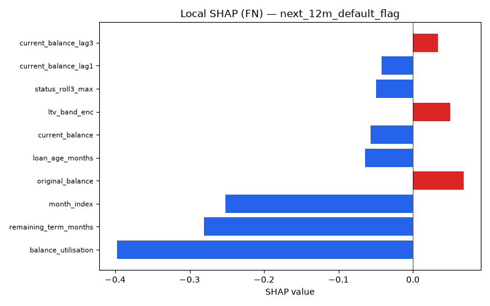
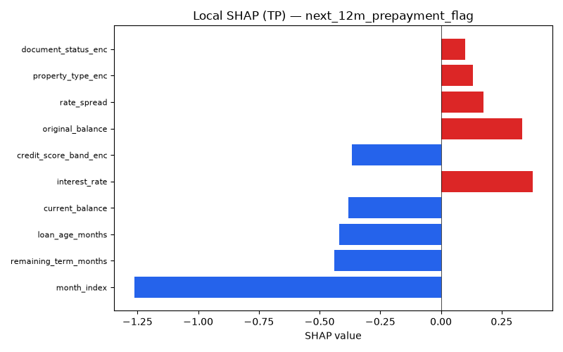
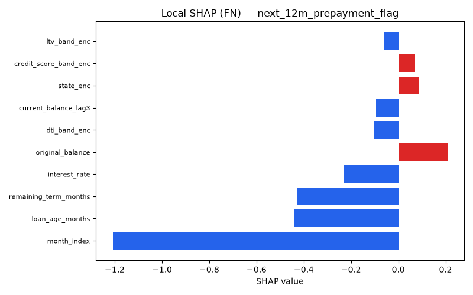

# Explainability Report

Generated on 2026-08-28 02:08

## next_3m_delinquency_flag

### Global Feature Importance (mean |SHAP|)

| Feature                  |   Mean_|SHAP| |
|:-------------------------|--------------:|
| days_past_due            |       0.24067 |
| dti_band_enc             |       0.23763 |
| credit_score_band_enc    |       0.23631 |
| ltv_band_enc             |       0.20601 |
| status_roll3_max         |       0.11597 |
| month_index              |       0.10373 |
| interest_rate            |       0.05756 |
| balance_utilisation      |       0.03848 |
| days_past_due_roll3_mean |       0.03332 |
| current_status_enc       |       0.03175 |

### FP/FN Analysis — next_3m_delinquency_flag

- **False Positives**: 310 (7.2% of predictions)
- **False Negatives**: 1,056 (24.4% of predictions)

**False Positives characteristics:**
  - `credit_score_band` mode: Fair
  - `ltv_band` mode: 75-90
  - `days_past_due` mean: 24.34
  - `loan_age_months` mean: 9.80

**False Negatives characteristics:**
  - `credit_score_band` mode: Good
  - `ltv_band` mode: 60-75
  - `days_past_due` mean: 7.22
  - `loan_age_months` mean: 11.07

### Prediction Uncertainty

Mean prediction entropy: **0.6056** (higher = more uncertain)

Fraction of records with entropy > 0.5: **0.888**

## next_6m_delinquency_flag

### Global Feature Importance (mean |SHAP|)

| Feature               |   Mean_|SHAP| |
|:----------------------|--------------:|
| credit_score_band_enc |       0.28122 |
| dti_band_enc          |       0.25493 |
| ltv_band_enc          |       0.22041 |
| days_past_due         |       0.11964 |
| balance_utilisation   |       0.11943 |
| month_index           |       0.10925 |
| status_roll3_max      |       0.09493 |
| interest_rate         |       0.06269 |
| current_status_enc    |       0.03665 |
| loan_age_months       |       0.02918 |

### FP/FN Analysis — next_6m_delinquency_flag

- **False Positives**: 724 (16.8% of predictions)
- **False Negatives**: 709 (16.4% of predictions)

**False Positives characteristics:**
  - `credit_score_band` mode: Good
  - `ltv_band` mode: 60-75
  - `days_past_due` mean: 10.75
  - `loan_age_months` mean: 10.16

**False Negatives characteristics:**
  - `credit_score_band` mode: Excellent
  - `ltv_band` mode: 60-75
  - `days_past_due` mean: 6.23
  - `loan_age_months` mean: 12.93

### Prediction Uncertainty

Mean prediction entropy: **0.6335** (higher = more uncertain)

Fraction of records with entropy > 0.5: **0.959**

## next_12m_default_flag

### Global Feature Importance (mean |SHAP|)

| Feature               |   Mean_|SHAP| |
|:----------------------|--------------:|
| balance_utilisation   |       0.76471 |
| remaining_term_months |       0.38032 |
| month_index           |       0.3619  |
| interest_rate         |       0.10554 |
| days_past_due         |       0.10096 |
| loan_age_months       |       0.0902  |
| current_balance_lag3  |       0.07938 |
| original_balance      |       0.07389 |
| current_balance       |       0.07312 |
| ltv_band_enc          |       0.06298 |

### FP/FN Analysis — next_12m_default_flag

- **False Positives**: 0 (0.0% of predictions)
- **False Negatives**: 19 (0.4% of predictions)

**False Negatives characteristics:**
  - `credit_score_band` mode: Good
  - `ltv_band` mode: 75-90
  - `days_past_due` mean: 37.63
  - `loan_age_months` mean: 1.84

### Prediction Uncertainty

Mean prediction entropy: **0.0189** (higher = more uncertain)

Fraction of records with entropy > 0.5: **0.001**

## next_12m_prepayment_flag

### Global Feature Importance (mean |SHAP|)

| Feature                    |   Mean_|SHAP| |
|:---------------------------|--------------:|
| month_index                |       1.77036 |
| remaining_term_months      |       0.61738 |
| loan_age_months            |       0.60818 |
| original_balance           |       0.28888 |
| current_balance            |       0.24827 |
| interest_rate              |       0.23672 |
| property_type_enc          |       0.19125 |
| state_enc                  |       0.16086 |
| rate_spread                |       0.14923 |
| current_balance_roll3_mean |       0.13789 |

### FP/FN Analysis — next_12m_prepayment_flag

- **False Positives**: 0 (0.0% of predictions)
- **False Negatives**: 52 (1.2% of predictions)

**False Negatives characteristics:**
  - `credit_score_band` mode: Good
  - `ltv_band` mode: 75-90
  - `days_past_due` mean: 0.67
  - `loan_age_months` mean: 1.69

### Prediction Uncertainty

Mean prediction entropy: **0.0469** (higher = more uncertain)

Fraction of records with entropy > 0.5: **0.000**

## next_state (Multiclass)
