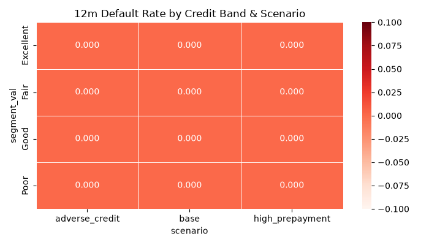

# Scenario & Stress Simulation Report

Generated on 2026-08-29 03:01

## Aggregate Projected Rates

| scenario        |   next_3m_delinquency_flag |   next_12m_default_flag |   next_12m_prepayment_flag |
|:----------------|---------------------------:|------------------------:|---------------------------:|
| base            |                   0.389361 |             1.63953e-16 |                4.14362e-12 |
| adverse_credit  |                   0.424651 |             1.60693e-16 |                4.20052e-12 |
| high_prepayment |                   0.353301 |             1.51647e-16 |                4.13355e-12 |

## Segment-Level Default Rate by Scenario

| segment_col       | segment_val   | scenario        |   default_rate |   n_loans |
|:------------------|:--------------|:----------------|---------------:|----------:|
| credit_score_band | Fair          | base            |              0 |       798 |
| credit_score_band | Fair          | adverse_credit  |              0 |       798 |
| credit_score_band | Fair          | high_prepayment |              0 |       798 |
| credit_score_band | Good          | base            |              0 |      1774 |
| credit_score_band | Good          | adverse_credit  |              0 |      1774 |
| credit_score_band | Good          | high_prepayment |              0 |      1774 |
| credit_score_band | Excellent     | base            |              0 |      1409 |
| credit_score_band | Excellent     | adverse_credit  |              0 |      1409 |
| credit_score_band | Excellent     | high_prepayment |              0 |      1409 |
| credit_score_band | Poor          | base            |              0 |       169 |
| credit_score_band | Poor          | adverse_credit  |              0 |       169 |
| credit_score_band | Poor          | high_prepayment |              0 |       169 |
| state             | CA            | base            |              0 |       547 |
| state             | CA            | adverse_credit  |              0 |       547 |
| state             | CA            | high_prepayment |              0 |       547 |
| state             | FL            | base            |              0 |       479 |
| state             | FL            | adverse_credit  |              0 |       479 |
| state             | FL            | high_prepayment |              0 |       479 |
| state             | TX            | base            |              0 |       459 |
| state             | TX            | adverse_credit  |              0 |       459 |
| state             | TX            | high_prepayment |              0 |       459 |
| state             | OH            | base            |              0 |       405 |
| state             | OH            | adverse_credit  |              0 |       405 |
| state             | OH            | high_prepayment |              0 |       405 |
| state             | IL            | base            |              0 |       391 |
| state             | IL            | adverse_credit  |              0 |       391 |
| state             | IL            | high_prepayment |              0 |       391 |
| state             | NY            | base            |              0 |       469 |
| state             | NY            | adverse_credit  |              0 |       469 |
| state             | NY            | high_prepayment |              0 |       469 |

## Scenario Sensitivity Drivers

The most sensitive inputs under each scenario:

- **adverse_credit**: `credit_score_band_enc` (+1 notch down) drives a 0.000 absolute increase in 12m default rate.

- **high_prepayment**: `interest_rate` shift (−0.75pp) and increased prepay propensity drive prepayment rate up by 0.000.
